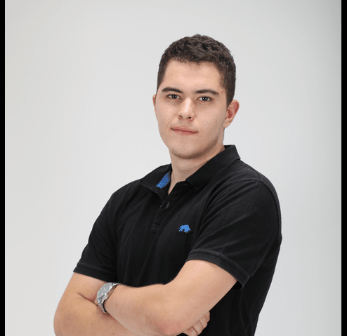

# A56 BlingBank Project Read Me

## Team

| Number  | Name                    | User                            | E-mail                                   |
|---------|-------------------------|---------------------------------|------------------------------------------|
| 1108390 | Niklas Herbster         | <https://github.com/NiklasTUM>  | <mailto:niklas.herbster@tecnico.ulisboa.pt> |
| 108705  | Vuk Jurišić            | <https://github.com/BobUser>    | <mailto:vuk.jurisic@tecnico.ulisboa.pt>  |
| 109100  | Kevin Ross              | <https://github.com/rossbremen> | <mailto:kevin.ross@tecnico.ulisboa.pt>|

   

## Contents

This repository contains documentation and source code for the *Network and Computer Security (SIRS)* project.

The [REPORT](REPORT.md) document provides a detailed overview of the key technical decisions and various components of the implemented project.
It offers insights into the rationale behind these choices, the project's architecture, and the impact of these decisions on the overall functionality and performance of the system.

This document presents installation and demonstration instructions.

*(adapt all of the following to your project, changing to the specific Linux distributions, programming languages, libraries, etc)*

## Installation

To see the project in action, it is necessary to setup a virtual environment, with N networks and M machines.  

The following diagram shows the networks and machines:


### Prerequisites

All the virtual machines are based on: Linux 64-bit, Kali 2023.3  

[Download](https://www.kali.org/get-kali/#kali-installer-images) and [install](https://github.com/tecnico-sec/Setup/blob/master/KaliSetup.md) a virtual machine of Kali Linux 2023.3.  
Clone the base machine to create the other machines.

In order to set up communication between the virtual machines, follow the provided diagram carefully.
It is crucial to configure the Network Adapters properly. The required settings are the following:

Set up Internal Networks for the Adapters to allow communication between the virtual machines.
In the advanced settings of the Network Adapter, set the Promiscuous Mode to Allow VMs.
Additionally, every virtual machine should be equipped with a Bridged Adapter to utilize the host machine's internet
connection for downloading necessary packages and tools.
Normally, most of the machines shouldn't be exposed to the internet but since this project is made for 
educational purposes, out of convenience we assume that the Bridged Adapters are manually being shut down by the user 
in the VirtualBox Settings of the VMs after the installation and configuration is completed.
The configuration script will shut the interface down automatically after the installation, 
but it will launch again after a reboot. 
Therefore, it is necessary to shut them down manually.

Before creating linked clones of the base machine, make sure to clone our GitHub repository on the base machine.
If you skip this step, you will need to set up an SSH key for each virtual machine individually.
The linked clones should choose the option "Generate new MAC addresses for all network adapters" to avoid conflicts.

All the configuration files can be found in the "vmsetups" directory. 
To be precise, 'setupVM1' contains the configuration files for the client, 'setupVM2' for the gateway, 'setupVM3' for
the server and 'setupVM4' for the mongoDB database.

*(above, replace witch actual links)*

### Machine configurations

For each machine, there is an initialization script with the machine name, with prefix `init-` and suffix `.sh`, that installs all the necessary packages and makes all required configurations in the a clean machine.

Inside each machine, use Git to obtain a copy of all the scripts and code.

```sh
$ cd ~/Desktop
$ git clone https://github.com/tecnico-sec/a56-niklas-kevin-vuk
```

Next we have custom instructions for each machine.

#### Machine 1

This machine runs the javaFX client.

```sh
$ cd ~/Desktop/a56-niklas-kevin-vuk/vmsetups/setupVM1
$ sudo ./init-vm1.sh
```

#### Machine 2

This machine acts as a gateway between the client and the server using nginx.

```sh
$ cd ~/Desktop/a56-niklas-kevin-vuk/vmsetups/setupVM2
$ sudo ./init-vm2.sh
```

#### Machine 3

This machine runs the Java-server.

```sh
$ cd ~/Desktop/a56-niklas-kevin-vuk/vmsetups/setupVM3
$ sudo ./init-vm3.sh
```

#### Machine 4

This machine hosts the mongoDB database.

```sh
$ cd ~/Desktop/a56-niklas-kevin-vuk/vmsetups/setupVM4
$ sudo ./init-vm4.sh
```

## Demo

Now that all the networks and machines are up and running, I will tell you how to use our application.

We built a simple JavaFX UI to help with the usage of the application. Although usage is rather straight-forward I will list the features we built and tell you more about usage. When you run our client application, you will by default end up on the login screen.

### Login Screen
On it you have 2 options, you can either create an account or log-in. If you already have an account log in using your username and password, otherwise go to:

### Create Account Screen
This screen is used to create a user account. User needs a login and a password and for this purpose, you can create an account here. You need a non-null username and a matching repeated non-null password (email is optional). After you click the **Create** button, a new account is created and stored. Username can't already exist, otherwise you will get an error.

### Dashboard Screen
Once you have logged in, now you're on dashboard. You can do 4 things. Intuitively, on top you can see log out button which does exactly that. There's 3 more buttons:
- Show bank account: on this one you can view your bank account if you have one.
- List transactions: here you can find a list of all transactions you have on your bank account, if you don't have a bank account, list will be empty and possibly an error will be shown
- Create bank account: On this page you can create a bank account if you don't have one yet. Click of this button will lead you to:

### Create Bank Account Screen
Once you're here you will see 3 fields: other holders, where you can specify anyone else you want to share an account with (user has to already have an account with that username). Balance field is set to 0 as that's your balance on creation. You can also specify the Currency (GBP, USD or EUR). Once you fill everything out, account can be created.

### Show Bank Account Screen
On this screen you can view your bank account (all holders, currency and balance). There's 2 more buttons: request transaction which leads you to the page where you can request one. There's also an unimplemented delete account button. Clicking it won't do anything.

### Request Transaction Screen
On this screen you can add an amount to top off and withdraw. PLease fill out all fields even if with 0. Description can be anything. After submitting it, transaction will be sent to server and immediately processed.

### List Transaction Screen
FInally, you have a chance to visualize all the transactions of your account. By clicking the button on dashboard, all transactions will be loaded into the table so you can nicely see them.

### Restrictions
- All users have distinct usernames
- Every user can have up to one account
- Each account can handle up to 4 transactions


## Additional Information
In order to actually be able to run the application, you need to go in every controller within this directory client-apk/src/main/java/sirs/com/controller, and change every url, into the commented one. We didn't have time to set-up our virtual machines so code that's currently in the repository is set up for VMs. However, changing the URLs and running application in intellij or just compiling jars should be good enough to run the application.

### Links to Used Tools and Libraries

- [Java 11.0.16.1](https://openjdk.java.net/)
- [Maven 3.9.5](https://maven.apache.org/)
- ...
